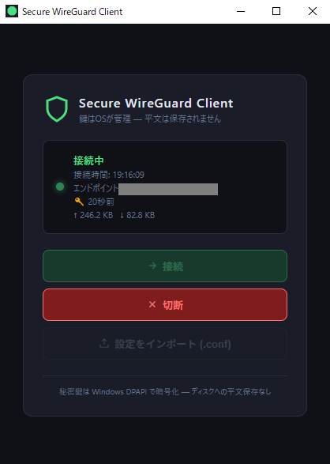

# SWGC — Secure WireGuard Client

Windows向けのセキュアなWireGuardクライアントです。[Tauri v2](https://tauri.app/) + Rust + React で実装されており、秘密鍵をディスクに平文で保存しないことを最大の特徴としています。

## 特徴

- **秘密鍵の平文保存なし** — 秘密鍵は [Windows DPAPI](https://learn.microsoft.com/ja-jp/windows/win32/api/dpapi/) で暗号化してレジストリに保存されます
- **メモリ内処理** — 接続時、秘密鍵はRustのヒープ上で復号されてカーネルドライバーに渡すのみ。設定ファイルへの書き出しは行いません
- **wireguard-nt利用** — [wireguard-nt](https://git.zx2c4.com/wireguard-nt) のカーネルモードドライバーを直接呼び出すことで、WireGuard for Windowsのサービスに依存しません
- **DLL署名検証** — WireGuard for Windowsがインストールした公式の署名済みDLLのみを読み込みます（`WinVerifyTrust` によるAuthenticode検証）
- **自動再接続** — セッションが期限切れになると自動的に再接続を試みます（ユーザーが「切断」ボタンを押した場合を除く）
- **セッション監視UI** — ハンドシェイクの経過時間・送受信バイト数をリアルタイム表示。セッションが古くなると警告を表示します

## スクリーンショット



## 必要環境

| 項目 | 要件 |
|---|---|
| OS | Windows 10 21H1 以降 (x64) |
| 権限 | 管理者権限 (wireguard.sys のインストールに必要) |
| ランタイム | Microsoft Visual C++ 再頒布可能パッケージ 2022 |
| **前提ソフト** | **[WireGuard for Windows](https://www.wireguard.com/install/) のインストール** |

> **なぜ WireGuard for Windows が必要なのか**
>
> SWGCは `C:\Program Files\WireGuard\wireguard.dll` を使用します。このDLLは
> WireGuard for Windowsのインストーラーが配置するもので、WireGuard LLCによって
> コード署名されています。SWGCはDLL読み込み時に `WinVerifyTrust` で署名を検証し、
> 未署名または改ざんされたDLLは拒否します。
>
> このリポジトリにDLLを同梱しないのは、第三者が配布するバイナリへの不信感を
> 避けるためです。公式インストーラーから入手することを強く推奨します。

## 使い方

### 準備

1. **[WireGuard for Windows](https://www.wireguard.com/install/)** をインストールします
   - SWGCはこのインストールで配置される `wireguard.dll` を使用します
   - WireGuard for Windows のトンネル機能自体は使用しません（DLLのみ必要です）

### 接続

2. リリースページから `swgc_x.x.x_x64-setup.exe` をダウンロードしてインストール
3. **管理者として**起動
4. **「設定をインポート (.conf)」** ボタンから WireGuard 設定ファイル (`.conf`) を選択
5. **「接続」** ボタンをクリック
6. ハンドシェイクが確立されると接続時間・TX/RXが表示されます

> **ヒント**: セキュリティのため、`.conf` の `Endpoint` には固定IPアドレスの使用を推奨します。

## ビルド方法

### 前提条件

- [Rust](https://rustup.rs/) (stable)
- [Node.js](https://nodejs.org/) 18以上
- [Tauri CLI](https://tauri.app/start/prerequisites/)
- [WireGuard for Windows](https://www.wireguard.com/install/) （実行時にDLLが必要）

```powershell
# 依存関係インストール
npm install

# 開発モードで起動 (管理者権限のターミナルで実行)
npm run tauri dev

# リリースビルド
npm run tauri build
```

> **wireguard.dll について**
>
> このリポジトリには `wireguard.dll` を含んでいません。
> 実行時に `C:\Program Files\WireGuard\wireguard.dll`（WireGuard for Windows
> のインストール先）を自動的に検索します。見つからない場合は起動時にエラーになります。
>
> 独自に wireguard-nt をビルドしたDLLを使う場合は、実行ファイルと同じフォルダに
> 配置してください（Authenticodeで署名されている必要があります）。
> 詳細は [wireguard-nt](https://git.zx2c4.com/wireguard-nt) を参照してください。

## アーキテクチャ

```
src/                    # React フロントエンド (TypeScript)
  App.tsx               # メインUI・ステータス表示・自動再接続検出
  commands.ts           # Tauri IPC ラッパー
src-tauri/src/          # Rust バックエンド
  wireguard.rs          # WireGuard tunnel管理・DLL署名検証・監視スレッド・自動再接続
  wg_nt.rs              # wireguard-nt FFI バインディング
  config.rs             # 設定ファイルのパース・DPAPI暗号化
  crypto.rs             # DPAPI ラッパー
  commands.rs           # Tauri コマンドハンドラー
```

wireguard.dll はこのリポジトリには含まれません。実行時に以下の順で検索します：

1. `C:\Program Files\WireGuard\wireguard.dll` （WireGuard for Windows — 推奨）
2. 実行ファイルと同じフォルダ
3. `C:\Windows\System32\wireguard.dll`

各パスのDLLは読み込み前に `WinVerifyTrust` による署名検証を行います。

### セキュリティ設計

```
.conf ファイル
    ↓ parse (64KB 上限チェック)
WgConfig (ヒープ上、ZeroizeOnDrop)
    ↓ DPAPI暗号化
レジストリ (HKCU\...\SWGC)
    ↓ 接続時にDPAPI復号
WgConfig (ヒープ上)
    ↓ WireGuardSetConfiguration
wireguard.sys (カーネル)
    ↓ ZeroizeOnDrop で上書きゼロ化
```

## 免責事項

このソフトウェアは個人利用・学習目的で、Claude Code (Sonnet 4.6)を用いて作成しました。ご利用は自己責任でお願いします。

## ライセンス

本プロジェクトのソースコード: **GNU General Public License v2.0**

wireguard-nt (`wireguard.dll`) はこのリポジトリには含まれません。実行時に
WireGuard for Windowsが提供するDLLを使用します (Copyright © WireGuard LLC, GPLv2)。
本プロジェクトのソースコードは wireguard-nt と動的リンクして動作するため、
GPLv2 で頒布しています。
